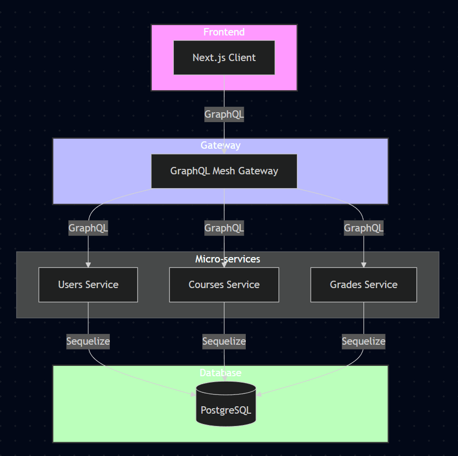

# 4AGQL - Projet final - Honoré Clément & Bosquet Ewen

[GitHub repository](https://github.com/Xeltax/4AGQL)

Ce projet est une application web de gestion de cours et de notes, un peu à la façon de EdSquare ou Moodle.

L'application est construite avec une **architecture en microservices**, chaque fonctionnalité est encapsulée dans un service indépendant pour une plus grande scalabilité et évolutivité.

## Technologies utilisées

- **GraphQL** : élément central du projet, qui définit la structure des échanges entre les clients et le serveur
- **PostgreSQL** : base de données utilisée pour stocker les données de chaque service.
- **Node.JS & JavaScript / Typescript** : technologies employées pour le développement des services et de l’application frontend.
- **Docker** : utilisé pour conteneuriser les services et orchestrer l’ensemble via le fichier [compose.yml](compose.yml).
- **Mesh** : gateway faisant la centralisation et la redirection des requêtes vers les services.

## Configuration

Tous les services se configurent avec des variables d'environnement. Un fichier `.env.example` donnant la configuration attendue est disponible pour chaque service :
- [users-service](./users-service/.env.example)
- [courses-service](./courses-service/.env.example)
- [grades-service](./grades-service/.env.example)
- [gateway](./gateway/.env.example)
  - Si les variables ne sont pas définies, la valeur par défaut attribuée est : _localhost_
- [front](./front/.env.example)
  - Si les variables ne sont pas définies, la valeur par défaut attribuée est : _http://127.0.0.1:4000/graphql_

## Présentation des services



### Api Gateway

Gateway Mesh utilisée pour centraliser et rediriger les requêtes vers les services adaptés

### Users service

Service de gestion des utilisateurs (création, consultation, édition, suppression).

S'occupe également de l'authentification et des authorisations (login, register). Les tokens d'authentification fournis ont une durée de vie d'une heure.

La gestion des roles dans le contexte de l'application a été simplifié :
- **ROLE_USER** : Étudiants
- **ROLE_ADMIN** : Professeurs

### Courses service

Service de gestion des cours (création, consultation, édition, suppression)

Se base sur token fourni par le client pour en déduire les autorisations.

### Grades service

Service de gestion des notes des étudiants et des cours (création, consultation, édition, suppression)

Se base sur token fourni par le client pour en déduire les autorisations.

## Lancement du projet

Pour installer les dépendances de chaque service, exécuter `npm i` dans les répertoires courants de chaque service.

Chaque service possède un script NPM `npm run start` permettant de l'exécuter en mode développement. Il se relancera à chaque modification dans le code.

Un `Dockerfile` est disponible pour chaque service permettant de fabriquer une image Docker et ainsi pouvoir les conteneuriser.

Une configuration Docker compose est disponible à la racine du projet [compose.yml](compose.yml).
Elle permet de fabriquer les images de chaque service et de les déployer dans un environnement totalement pré-configuré.

Le script [compose-cleanup.sh](compose-cleanup.sh) permet de détruire tous les conteneurs déployés depuis le fichier [compose.yml](compose.yml) et supprimé toutes les images fabriquées pour rendre votre environnement Docker local propre.

Le lancement complet du projet peut prendre quelques minutes à l'issue des quelles vous pouvez vous rendre sur l'interface web de l'application disponible à l'adresse [http://localhost:3000](http://localhost:3000).
```sh
docker compose up -d --build
```

## Gestion des données

Un jeu de données est préchargé par chaque service. Deux utilisateurs par défaut sont créer avec lesquels vous pouvez vous connecter depuis l'interface de login de l'application :

- admin@admin.com:password (administrateur / professeur)
- user@user.com:password (utilisateur / étudiant)

## Tests

Nous n'avons pas eu le temps d'implémenter des tests pour chaque service. Toutefois, nous avons implementer les tests minimaux attendus pour le service utilisateurs. Un script NPM `npm run test` permet l'exécution de ces tests

## Axes d'amélioration

- Centraliser les fichiers communs dans une bibliothèque partagée entre les micro-services au lieu de les dupliquer comme les fichiers model.
- Avoir une meilleure organisation par couche (controller / service / repository). Par précipitation, ces couches ont parfois été mélangées.

## Disclaimer

Certaines fonctionnalités peuvent manquer dans l'interface web du projet, mais elles sont toutes fonctionnels d'un point de vue backend.
Une collection [Yaak](docs/yaak.4aagql.json), outil équivalent à Postman open source est disponible pour tester chaque endpoint.